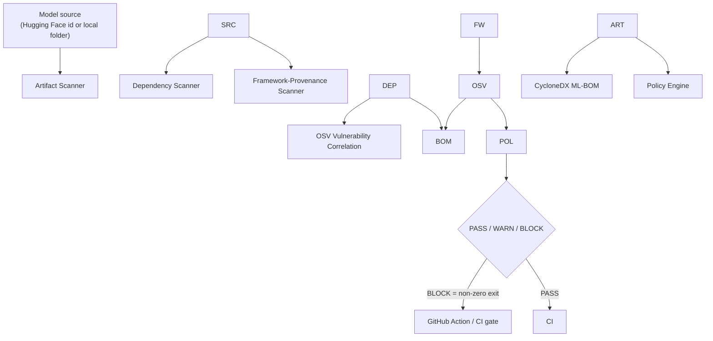
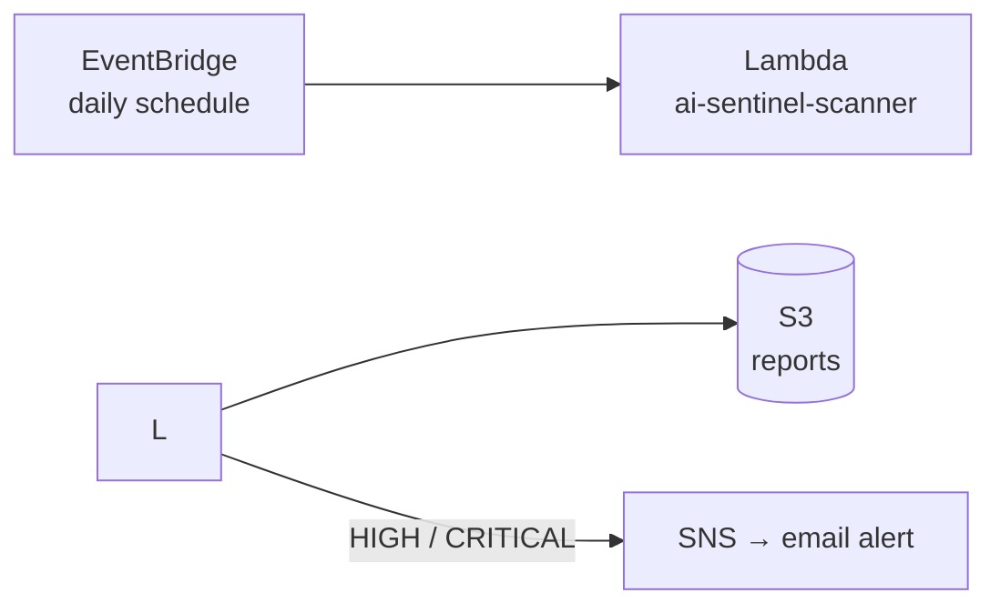
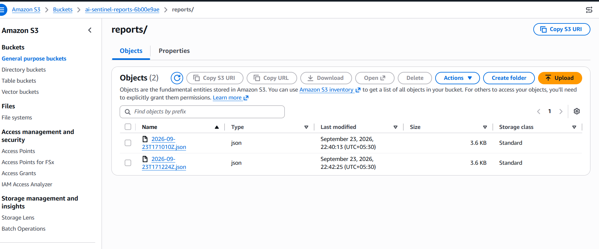

# AI Model Ingestion Gate

> A policy-driven CI gate that scans an AI model's artifacts and dependencies, emits a CycloneDX ML-BOM, and decides \*\*PASS / WARN / BLOCK\*\* before the model is allowed into deployment — plus a scheduled cloud scanner that continuously re-checks an approved model inventory as new CVEs are published.

**Live demo:** [`sentinel-demo`](https://github.com/Arjun7114/sentinel-demo) — a project protected by this gate, where a pull request adding a vulnerable model is **automatically blocked** by branch protection. See the blocked pull request: [sentinel-demo PR #1](https://github.com/Arjun7114/sentinel-demo/pull/1).

\---

## What it does

`aisentinel scan <model>` takes a Hugging Face model id **or** a local model folder and runs it through an ingestion gate:

1. **Artifact scan** — inspects each model file's **contents**, not just its extension. Pickle-based weights (`.bin`/`.pt`/`.pkl`) are run through [modelscan](https://github.com/protectai/modelscan)'s opcode analysis, which detects the dangerous `GLOBAL`/`REDUCE` operators used for code-execution-on-load. A clean pickle is distinguished from a weaponized one; only genuinely dangerous files are treated as critical.
2. **Dependency scan** — extracts the model's declared Python dependencies (from a `requirements.txt` when present).
3. **Framework-provenance scan** — reads the model's `config.json` and checks the framework version it was *built with* (e.g. `transformers\_version`) against OSV. This is a provenance signal, reported but never used to block (see the note below).
4. **Vulnerability correlation** — queries the live [OSV](https://osv.dev) database (no API key) for known CVEs in those dependencies and normalizes them to a severity scale.
5. **ML-BOM** — emits a schema-valid **CycloneDX 1.6** bill of materials: the model as the primary component, dependencies as components, vulnerabilities linked to the components they affect.
6. **Policy decision** — evaluates all findings against a YAML policy and returns a single **PASS / WARN / BLOCK** verdict, exiting non-zero on BLOCK so it can fail a CI build.

The gate is designed to be **precise, not merely strict**: it does not fail every pickle file. A pickle that modelscan verifies as clean is a warning (safetensors is still preferred), while a pickle containing dangerous operators is a block. Precision is what makes the gate usable in a real pipeline rather than something teams learn to ignore.

**A deliberate honesty about framework provenance:** the version in a model's `config.json` is the version that *built* the model, not the version you *run* it with. A model built with an old `transformers` is worth noting, but it is not proof your deployment is exploitable — so these findings are surfaced for awareness and never block. Blocking on "built-with" would reject safe models and train teams to disable the gate. This built-with-vs-run-with distinction is the difference between a useful signal and a false positive.

## Why this exists

Most AI security tooling assumes the model is already trusted and running — it secures what a model *does* at runtime, or how it *serves*. Almost nothing checks the one moment that comes first: **the instant a model artifact enters your system.**

In 2026 that moment is a real attack surface. Model weights ship in formats (pickle) that can execute code on load, dependency chains around `transformers`/`langchain` are targets for confusion attacks, and provenance is usually unverified. Regulators have caught up too — the G7's minimum-elements guidance for AI SBOMs makes a machine-readable model bill of materials a compliance artifact, not just a nice-to-have.

This project closes that gap: it decides **whether a model should be admitted at all** — before it is ever deployed — and then keeps watching it after admission.

## Where it sits in the model lifecycle

```mermaid
flowchart LR
    A\[Model acquired] --> B\[Model served] --> C\[Model runtime I/O] --> D\[Detection / SOC]

    A -.covered by.-> AG\[\*\*AI Model Ingestion Gate\*\*<br/>this project]
    B -.covered by.-> VL\[vllm-inference-stack]
    C -.covered by.-> GW\[llm-guardrails-gateway]
    D -.covered by.-> CX\[Cortex-Chain / aiops-log-anomaly]

    style AG fill:#1e2327,color:#fff,stroke:#4a9,stroke-width:2px
```

Each control point secures a different stage of a model's life. This project owns the **ingestion** stage — the only one the others don't cover. It secures *whether a model should ever be admitted*, not what it does once it's trusted.

## Architecture



The scanners resolve a single **source** abstraction, so the exact same pipeline runs against a public Hugging Face model or a local model directory in a repository — which is what lets the gate run in CI on a pull request. When files are available on local disk (as in a CI checkout), pickle artifacts get full modelscan opcode inspection; for a remote listing where only the file list is available, the scanner falls back to a format-level flag and says so. Hugging Face access uses a small pure-Python REST client (no heavyweight SDK), which keeps the scan path light enough to package for a serverless environment.

## What this is / isn't

**It is** an *orchestration and policy layer.* It composes existing best-in-class checks — modelscan's pickle opcode analysis and the OSV vulnerability database — into a single, standards-compliant, policy-driven gate that runs in CI.

**It is not** a new scanner engine, and it does not claim to be. It does not reinvent vulnerability databases or bill-of-materials formats — it uses the real ones (OSV, CycloneDX). The differentiator is the integration + the policy-as-code decision + CI enforcement.

## Quickstart

```bash
git clone https://github.com/Arjun7114/ai-model-ingestion-gate.git
cd ai-model-ingestion-gate
python -m venv .venv \&\& . .venv/bin/activate   # Windows: .venv\\Scripts\\activate
pip install -e .
```

```bash
# Scan a public model
aisentinel scan gpt2

# Scan and write a CycloneDX ML-BOM
aisentinel scan gpt2 --sbom out.cdx.json

# Scan and apply a policy (exits non-zero on BLOCK)
aisentinel scan ./model --policy policies/default.yaml
```

## Example: a blocked model

Scanning a model with pickle weights and outdated dependencies:

```
AI-SENTINEL — Model Ingestion Report
Target:   tests/fixtures/vulnerable-model
Kind:     local

Artifacts
  \[FAIL] unsafe\_serialization: 1 pickle-based artifact(s) found: pytorch\_model.bin.

Dependencies
  - requests==2.19.0
  - pyyaml==5.1
  - jinja2==2.10

Vulnerabilities (OSV)
  \[CRIT] pyyaml==5.1 GHSA-3pqx-4fqf-j49f: Deserialization of Untrusted Data in PyYAML
  ... (further findings) ...

Policy Decision
  \[BLOCK] unsafe\_serialization: Pickle-based weights can execute arbitrary code on load.
  \[BLOCK] vulnerability\_high: A HIGH dependency vulnerability was found.
  \[BLOCK] vulnerability\_critical: A CRITICAL dependency vulnerability was found.

  DECISION: BLOCK
```

Exit code: `1` — which fails the CI build.

## The gate in action (CI enforcement)

The [`sentinel-demo`](https://github.com/Arjun7114/sentinel-demo) repository is a project protected by this gate. Its `main` branch holds a clean, approved model and the gate passes. A pull request that swaps in a vulnerable model is **blocked**: the gate check fails, and branch protection makes that failure binding — the merge button is disabled until the model passes.

**A pull request adding a vulnerable model is blocked:**

!\[Pull request blocked by the gate](docs/images/pr-blocked.png)

**The gate's output on the CI run — a critical PyYAML CVE and a BLOCK decision:**

!\[Gate run output showing BLOCK decision](docs/images/gate-output.png)

## Continuous re-scanning (cloud scanner)

A model that passes the gate today is not safe forever. New CVEs are published constantly — many of the advisories this tool reports for older framework versions did not exist when those models were released. A one-time ingestion check cannot catch a vulnerability disclosed after admission.

The `deploy/` directory contains a **scheduled cloud scanner** that closes this gap: an AWS Lambda, triggered daily by EventBridge, re-scans a list of approved models, writes a JSON report to S3, and publishes an SNS email alert when any model has a HIGH/CRITICAL finding.



Design decisions worth noting:

* **Lightweight by design.** The cloud scanner does metadata-level checks (file listing, declared dependencies, framework provenance, OSV correlation) — not full weight downloads or deep opcode inspection. Deep inspection belongs in the CI gate, which has a full checkout; the scheduled scanner's job is breadth across the whole inventory, not depth on one model. Two jobs, two tradeoffs.
* **Pure-Python package.** The Lambda depends only on `requests` and `pyyaml` (both pure-Python), so it packages to a \~1.5 MB zip with no native-binary or cross-platform headaches. The Hugging Face SDK was replaced with a small REST client specifically to keep this path light.
* **Least privilege.** The Lambda's IAM role can write only to its own S3 bucket and publish only to its own SNS topic — nothing else. The reports bucket blocks all public access.
* **Infrastructure as code, fully destroyable.** The whole stack (S3, SNS, IAM, Lambda, EventBridge) is defined in Terraform under `deploy/terraform/` and stands up or tears down with a single command. This continues the infra-as-code approach from `secure-aws-baseline` and `eks-devsecops-pipeline`.

Each scan writes a structured report per model — artifacts, declared dependencies, framework provenance, and a computed worst severity — that any downstream tool can consume.


\*\*Reports written to S3 by the scheduled scanner:\*\*





## Results — what the demo proves

Measured against the project's test fixture, real Hugging Face models, the live `sentinel-demo` CI runs, and the deployed cloud scanner:

|What|Result|
|-|-|
|Scanner types integrated|4 — artifact opcode inspection, dependency, framework provenance, vulnerability|
|Pickle inspection|modelscan opcode analysis; distinguishes a clean pickle from a malicious one|
|Real model check (`gpt2`)|pickle verified clean → `WARN`, not a blanket fail|
|Framework provenance|reads `transformers\_version` from `config.json`, correlates against OSV (informational)|
|CVEs correlated on the vulnerable fixture|28, from the live OSV database|
|Highest severity detected|CRITICAL (PyYAML deserialization / RCE)|
|Bill-of-materials format|CycloneDX 1.6, schema-valid, vulnerabilities linked to components|
|Clean model|`DECISION: PASS`, exit code 0|
|Vulnerable model|`DECISION: BLOCK`, exit code 1|
|Scan step runtime in CI|\~4 seconds|
|CI enforcement|Branch protection makes a BLOCK binding — merge is disabled|
|Cloud scanner|daily Lambda scans an inventory, writes S3 reports, emails HIGH/CRITICAL alerts|

These are descriptive facts about the working pipeline, not accuracy benchmarks. Establishing precision/recall against a labeled corpus of malicious models is future work (see Roadmap).

## Policy-as-code

Policy is declarative YAML — the same mental model as admission policy in Kubernetes, applied to model ingestion. The most severe action triggered across all findings decides the verdict.

```yaml
version: 1
rules:
  unsafe\_serialization:   { action: BLOCK }   # pickle by format (not deep-inspected)
  malicious\_opcode:       { action: BLOCK }   # modelscan found dangerous operators
  pickle\_inspected\_clean: { action: WARN }    # pickle, but verified clean by modelscan
  vulnerability\_critical: { action: BLOCK }
  vulnerability\_high:     { action: BLOCK }
  vulnerability\_medium:   { action: WARN }
  vulnerability\_low:      { action: WARN }
  no\_recognized\_weights:  { action: WARN }
default\_action: WARN
```

See [`policies/default.yaml`](policies/default.yaml).

## How it fits the wider portfolio

|Repo|Control point|
|-|-|
|`eks-devsecops-pipeline`|Cloud + Kubernetes + CI/CD|
|`kyverno-policy-as-code`|Admission policy / K8s governance|
|`secure-aws-baseline`|Cloud security infrastructure|
|`llm-guardrails-gateway`|LLM runtime I/O security|
|`Cortex-Chain`|SOC triage \& analytics|
|`vllm-inference-stack`|Secure / observable LLM serving|
|**`ai-model-ingestion-gate`**|**AI model supply chain — ingestion gate + continuous re-scanning**|

This project reuses the policy-as-code thinking from the Kyverno work, the fail-the-build CI pattern from the DevSecOps pipeline, and the Terraform/least-privilege approach from the AWS baseline — pointed at a new control point.

## Roadmap

**v1 — the ingestion gate (complete)**

* \[x] Artifact scanner with modelscan opcode inspection (clean vs. malicious pickle)
* \[x] Dependency scanner
* \[x] Framework-provenance scanner (declared framework version vs. OSV)
* \[x] OSV vulnerability correlation
* \[x] CycloneDX ML-BOM generation
* \[x] Policy engine (PASS / WARN / BLOCK)
* \[x] GitHub Action + demo repo with an enforced, branch-protected block
* \[x] Scheduled cloud scanner (Terraform: Lambda + EventBridge + S3 + SNS)

**Deliberately deferred (not yet built)**

Intentionally out of scope, so the project ships coherent pieces end-to-end rather than several half-built:

* Runtime security lab (Falco: process/file/network anomaly detection on a live GPU workload)
* Dashboard + API
* Model signing / verification (Sigstore/Cosign, in-toto)
* NVD correlation, MITRE ATLAS technique mapping
* Publishing to PyPI

## Tech

Python · Typer (CLI) · pure-Python Hugging Face REST client · modelscan (pickle opcode analysis) · OSV API · cyclonedx-python-lib (CycloneDX 1.6) · PyYAML · GitHub Actions · AWS Lambda · EventBridge · S3 · SNS · Terraform

## License

TBD

