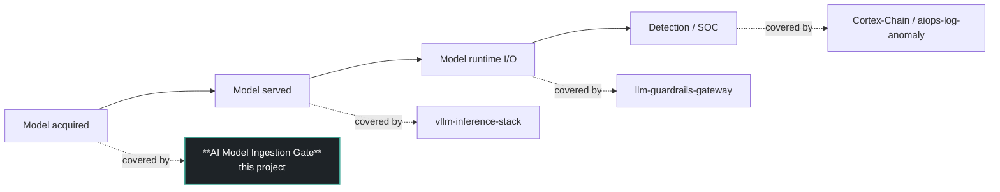
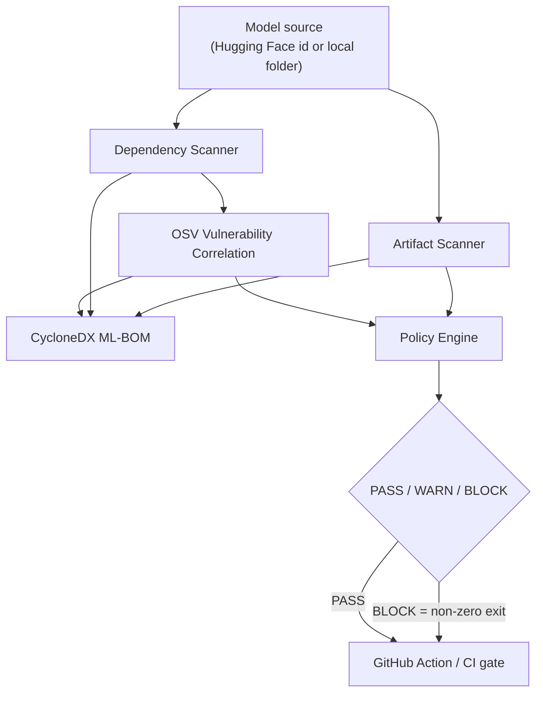
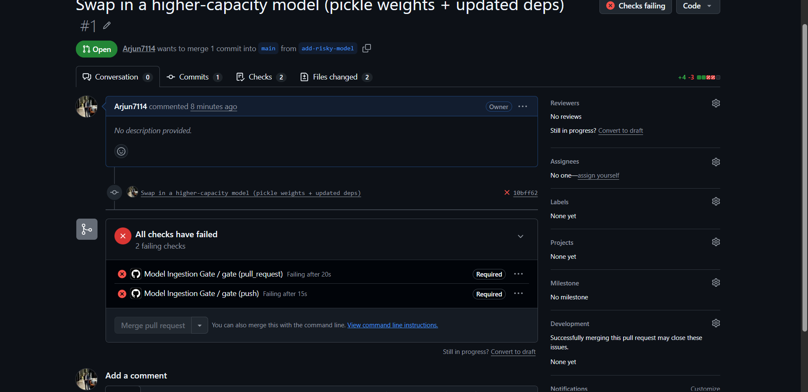
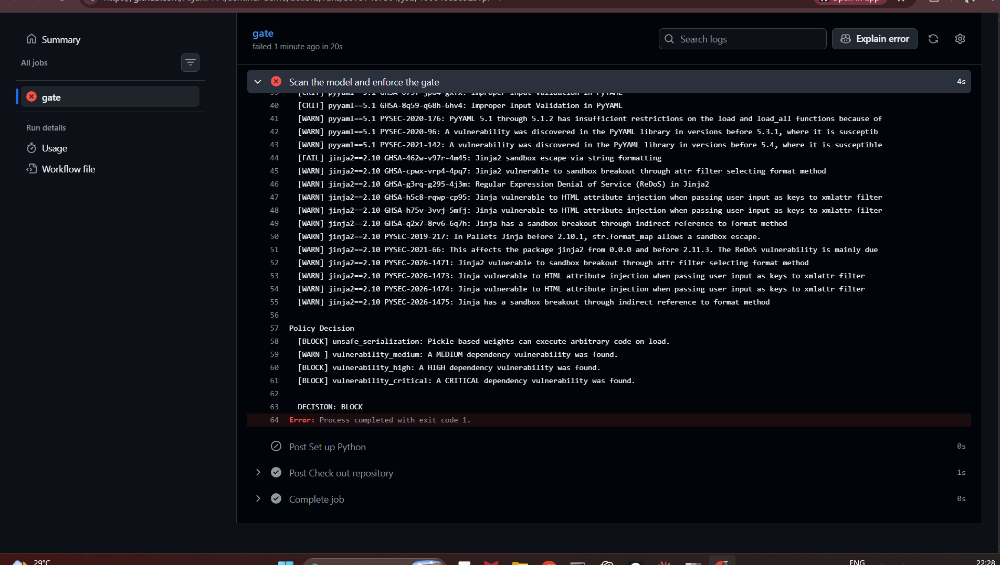

# AI Model Ingestion Gate

> A policy-driven CI gate that scans an AI model's artifacts and dependencies, emits a CycloneDX ML-BOM, and decides **PASS / WARN / BLOCK** before the model is allowed into deployment.

**Live demo:** [`sentinel-demo`](https://github.com/Arjun7114/sentinel-demo) — a project protected by this gate, where a pull request adding a vulnerable model is **automatically blocked** by branch protection. See the blocked pull request: [sentinel-demo PR #1](https://github.com/Arjun7114/sentinel-demo/pull/1).

---

## What it does

`aisentinel scan <model>` takes a Hugging Face model id **or** a local model folder and runs it through an ingestion gate:

1. **Artifact scan** — inspects each model file's **contents**, not just its extension. Pickle-based weights (`.bin`/`.pt`/`.pkl`) are run through [modelscan](https://github.com/protectai/modelscan)'s opcode analysis, which detects the dangerous `GLOBAL`/`REDUCE` operators used for code-execution-on-load. A clean pickle is distinguished from a weaponized one; only genuinely dangerous files are treated as critical.
2. **Dependency scan** — extracts the model's declared Python dependencies.
3. **Vulnerability correlation** — queries the live [OSV](https://osv.dev) database (no API key) for known CVEs in those dependencies and normalizes them to a severity scale.
4. **ML-BOM** — emits a schema-valid **CycloneDX 1.6** bill of materials: the model as the primary component, dependencies as components, vulnerabilities linked to the components they affect.
5. **Policy decision** — evaluates all findings against a YAML policy and returns a single **PASS / WARN / BLOCK** verdict, exiting non-zero on BLOCK so it can fail a CI build.

The gate is designed to be **precise, not merely strict**: it does not fail every pickle file. A pickle that modelscan verifies as clean is a warning (safetensors is still preferred), while a pickle containing dangerous operators is a block. Precision is what makes the gate usable in a real pipeline rather than something teams learn to ignore.

## Why this exists

Most AI security tooling assumes the model is already trusted and running — it secures what a model *does* at runtime, or how it *serves*. Almost nothing checks the one moment that comes first: **the instant a model artifact enters your system.**

In 2026 that moment is a real attack surface. Model weights ship in formats (pickle) that can execute code on load, dependency chains around `transformers`/`langchain` are targets for confusion attacks, and provenance is usually unverified. Regulators have caught up too — the G7's minimum-elements guidance for AI SBOMs makes a machine-readable model bill of materials a compliance artifact, not just a nice-to-have.

This project closes that gap: it decides **whether a model should be admitted at all** — before it is ever deployed.

## Where it sits in the model lifecycle



Each control point secures a different stage of a model's life. This project owns the **ingestion** stage — the only one the others don't cover. It secures *whether a model should ever be admitted*, not what it does once it's trusted.

## Architecture



The scanners resolve a single **source** abstraction, so the exact same pipeline runs against a public Hugging Face model or a local model directory in a repository — which is what lets the gate run in CI on a pull request. When files are available on local disk (as in a CI checkout), pickle artifacts get full modelscan opcode inspection; for a remote listing where only the file list is available, the scanner falls back to a format-level flag and says so.

## What this is / isn't

**It is** an *orchestration and policy layer.* It composes existing best-in-class checks — modelscan's pickle opcode analysis and the OSV vulnerability database — into a single, standards-compliant, policy-driven gate that runs in CI.

**It is not** a new scanner engine, and it does not claim to be. It does not reinvent vulnerability databases or bill-of-materials formats — it uses the real ones (OSV, CycloneDX). The differentiator is the integration + the policy-as-code decision + CI enforcement.

## Quickstart

```bash
git clone https://github.com/Arjun7114/ai-model-ingestion-gate.git
cd ai-model-ingestion-gate
python -m venv .venv && . .venv/bin/activate   # Windows: .venv\Scripts\activate
pip install -e .
```

```bash
# Scan a public model
aisentinel scan gpt2

# Scan and write a CycloneDX ML-BOM
aisentinel scan gpt2 --sbom out.cdx.json

# Scan and apply a policy (exits non-zero on BLOCK)
aisentinel scan ./model --policy policies/default.yaml
```

## Example: a blocked model

Scanning a model with pickle weights and outdated dependencies:

```
AI-SENTINEL — Model Ingestion Report
Target:   tests/fixtures/vulnerable-model
Kind:     local

Artifacts
  [FAIL] unsafe_serialization: 1 pickle-based artifact(s) found: pytorch_model.bin.

Dependencies
  - requests==2.19.0
  - pyyaml==5.1
  - jinja2==2.10

Vulnerabilities (OSV)
  [CRIT] pyyaml==5.1 GHSA-3pqx-4fqf-j49f: Deserialization of Untrusted Data in PyYAML
  ... (further findings) ...

Policy Decision
  [BLOCK] unsafe_serialization: Pickle-based weights can execute arbitrary code on load.
  [BLOCK] vulnerability_high: A HIGH dependency vulnerability was found.
  [BLOCK] vulnerability_critical: A CRITICAL dependency vulnerability was found.

  DECISION: BLOCK
```

Exit code: `1` — which fails the CI build.

## The gate in action (CI enforcement)

The [`sentinel-demo`](https://github.com/Arjun7114/sentinel-demo) repository is a project protected by this gate. Its `main` branch holds a clean, approved model and the gate passes. A pull request that swaps in a vulnerable model is **blocked**: the gate check fails, and branch protection makes that failure binding — the merge button is disabled until the model passes.

<!-- To display screenshots, add the image files under docs/images/ and keep the paths below. -->

**A pull request adding a vulnerable model is blocked:**



**The gate's output on the CI run — a critical PyYAML CVE and a BLOCK decision:**



## Results — what the demo proves

Measured against the project's test fixture, a real Hugging Face model, and the live `sentinel-demo` CI runs:

| What | Result |
|---|---|
| Scanner types integrated | 3 — artifact opcode inspection, dependency, vulnerability |
| Pickle inspection | modelscan opcode analysis; distinguishes a clean pickle from a malicious one |
| Real model check (`gpt2`) | pickle verified clean → `WARN`, not a blanket fail |
| CVEs correlated on the vulnerable fixture | 28, from the live OSV database |
| Highest severity detected | CRITICAL (PyYAML deserialization / RCE) |
| Bill-of-materials format | CycloneDX 1.6, schema-valid, vulnerabilities linked to components |
| Clean model | `DECISION: PASS`, exit code 0 |
| Vulnerable model | `DECISION: BLOCK`, exit code 1 |
| Scan step runtime in CI | ~4 seconds |
| Enforcement | Branch protection makes a BLOCK binding — merge is disabled |

These are descriptive facts about the working pipeline, not accuracy benchmarks. Establishing precision/recall against a labeled corpus of malicious models is future work (see Roadmap).

## Policy-as-code

Policy is declarative YAML — the same mental model as admission policy in Kubernetes, applied to model ingestion. The most severe action triggered across all findings decides the verdict.

```yaml
version: 1
rules:
  unsafe_serialization:   { action: BLOCK }   # pickle / code execution on load
  vulnerability_critical: { action: BLOCK }
  vulnerability_high:     { action: BLOCK }
  vulnerability_medium:   { action: WARN }
  vulnerability_low:      { action: WARN }
  no_recognized_weights:  { action: WARN }
default_action: WARN
```

See [`policies/default.yaml`](policies/default.yaml).

## How it fits the wider portfolio

| Repo | Control point |
|---|---|
| `eks-devsecops-pipeline` | Cloud + Kubernetes + CI/CD |
| `kyverno-policy-as-code` | Admission policy / K8s governance |
| `secure-aws-baseline` | Cloud security infrastructure |
| `llm-guardrails-gateway` | LLM runtime I/O security |
| `Cortex-Chain` | SOC triage & analytics |
| `vllm-inference-stack` | Secure / observable LLM serving |
| **`ai-model-ingestion-gate`** | **AI model supply chain — ingestion gate** |

This project reuses the policy-as-code thinking from the Kyverno work and the fail-the-build CI pattern from the DevSecOps pipeline, pointed at a new control point.

## Roadmap

**v1 — the ingestion gate (complete)**
- [x] Artifact scanner with modelscan opcode inspection (clean vs. malicious pickle)
- [x] Dependency scanner
- [x] OSV vulnerability correlation
- [x] CycloneDX ML-BOM generation
- [x] Policy engine (PASS / WARN / BLOCK)
- [x] GitHub Action + demo repo with an enforced, branch-protected block

**Phase 2 — deliberately deferred (not yet built)**

Intentionally out of v1 scope, so v1 ships one control point end-to-end rather than several half-built:
- Runtime security lab (Falco: process/file/network anomaly detection on a live GPU workload)
- Dashboard + API
- Model signing / verification (Sigstore/Cosign, in-toto)
- NVD correlation, MITRE ATLAS technique mapping
- Publishing to PyPI

## Tech

Python · Typer (CLI) · huggingface-hub · modelscan (pickle opcode analysis) · OSV API · cyclonedx-python-lib (CycloneDX 1.6) · PyYAML · GitHub Actions

## License

TBD
